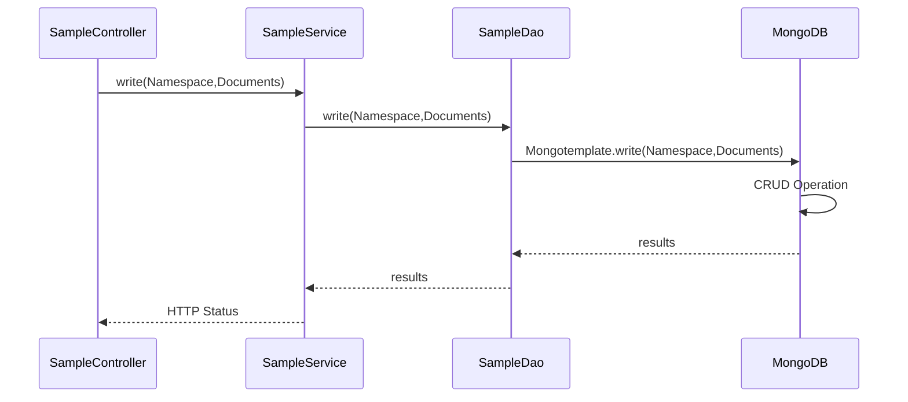
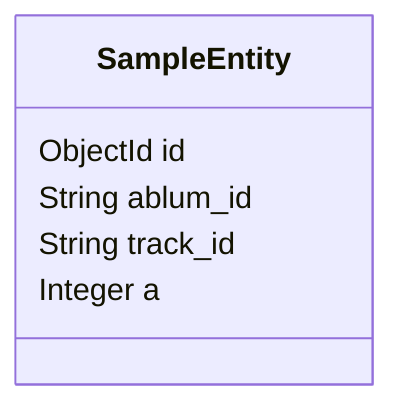
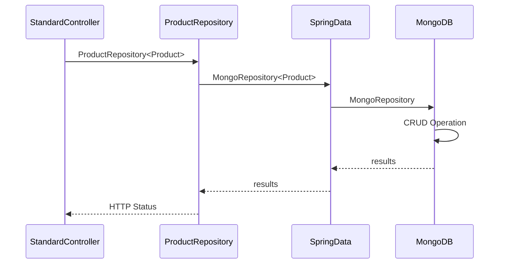
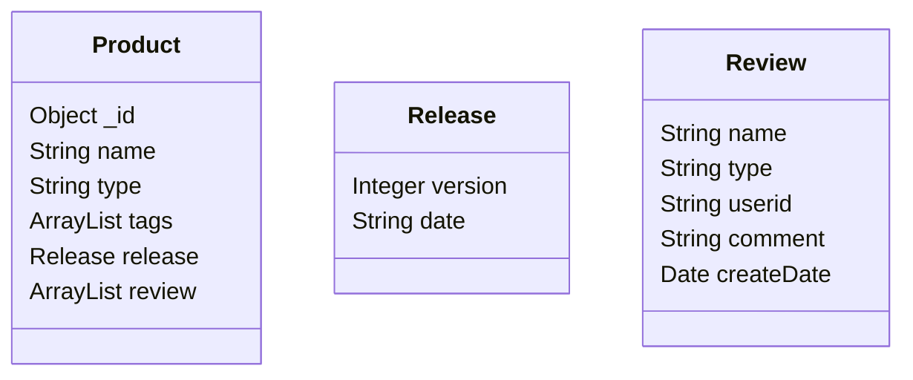

# MongoDB Golang REST API Sample

Golang Server를 만들어서 REST API를 통해 MongoDB에 대해 CRUD(Create, Read, Update, Delete)를 수행해본다. 
- 참고 GitHub: https://github.com/DonghanKimAAI/toy-code/tree/training/mongodb/training/java 

## Getting Started

### Prerequisites - for MacBook

- install Golang: https://go.dev/doc/install
  - nodemon for auto-restart server as code changs
  ```bash
  $ npm install -g nodemon
  ```
- install MongoDB server
  ```bash
  $ brew install mongodb-community@6.0
  ```

- Optional servers for monitoring:
  - Prometheus 
    - Default server: http://localhost:9090
    - Additional targer(API server) information setting needed
  - Grafana
    - Default server: http://localhost:3000
    - Additional source and dashboard setting needed
  ```bash
  $ brew install prometheus grafana
  ```

### Execution

- Run MongoDB(and optionally Prometheus and Grafana)
  ```bash
  $ brew services list # check current status
  $ brew services start mongodb-community
  $ brew services start prometheus
  $ brew services start grafana 
  ```
  Services List
  ```bash
  $ brew services list                                      
  Name              Status  User    File
  grafana           started hsjeong ~/Library/LaunchAgents/homebrew.mxcl.grafana.plist
  mongodb-community started hsjeong ~/Library/LaunchAgents/homebrew.mxcl.mongodb-community.plist
  prometheus        started hsjeong ~/Library/LaunchAgents/homebrew.mxcl.prometheus.plist
  unbound           none   
  ```
  
- Run Golang Server
  ```bash
  $ make run # server will run on the port ":8888"
  ```

## API LIST
RequestMethod|URL|Parameters|Note
-----|-----|-----|-----
POST|/v1/{db}/{collection}|db:database name<br>collection:collection name<br>body:RAW JSON of Product array|지정한 database/collection에 product를 추가한다.
GET|/v1/{db}/{collection}/findone|db:database name<br>collection:collection name<br>query:filed and value as a filter|최소한 하나의 필터값은 필요하다.
GET|/v1/{db}/{collection}/find|db:database name<br>collection:collection name<br>query:filed and value as a filter|필터값이 없으면 전체 document를 가져온다.
GET|/v1/{db}/{collection}/count|db:database name<br>collection:collection name<br>query:filed and value as a filter|필터값이 없으면 전체 document의 개수이다.
PUT|/v1/{db}/{collection}/{productName}/review|db:database name<br>collection:collection name<br>productName: product name<br>body: RAW JSON of review|지정한 document에 review를 추가한다.
PUT|/v1/{db}/{collection}/{productName}/tag|db:database name<br>collection:collection name<br>productName: product name<br>body: RAW JSON of tag|지정한 document에 tag를 추가한다.
DELETE|/v1/{db}/{collection}/count|db:database name<br>collection:collection name<br>query:filed and value as a filter|필터값이 없으면 전체 document를 삭제한다.

### Entity Relationshop Diagram

#### Simple Controller / Service / Dao Model

##### POJO Class

- com.project.sample.SampleEntity

##### Simple Sequence Diagram






#### Spring Data Model

##### Simple Sequence Diagram



##### POJO Class

- com.project.std.dto.Product
- com.project.std.dto.Release
- com.project.std.dto.Review



