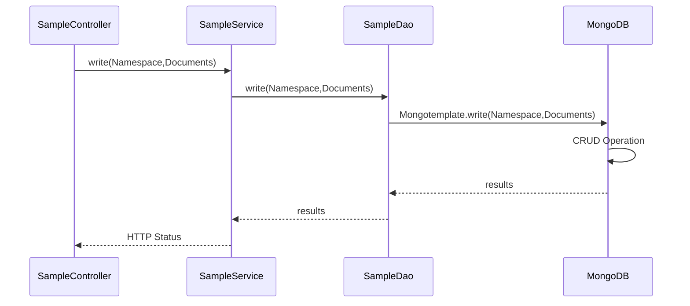
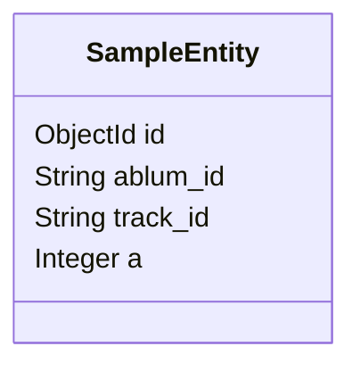
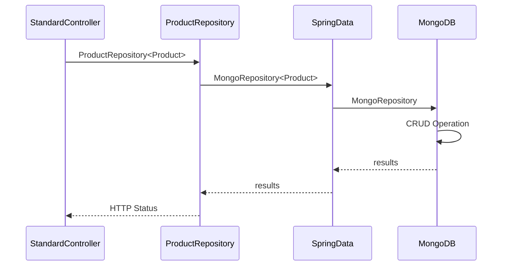
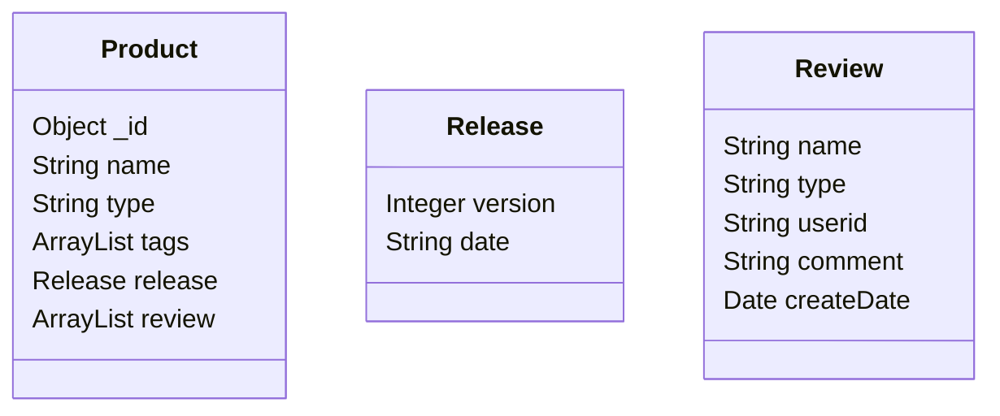

# MongoDB Golang REST API Sample

Golang Server를 만들어서 REST API를 통해 MongoDB에 대해 CRUD(Create, Read, Update, Delete)를 수행해본다. 
- 참고 GitHub: https://github.com/DonghanKimAAI/toy-code/tree/training/mongodb/training/java 

## Getting Started

## Prerequisites

- Golang 
- MongoDB: Running server with connect information

## Execution

- Run MongoDB
- Run Golang Server
- Test REST API 

### API LIST
RequestMethod|URL|Parameters
-----|-----|-----
POST|​/api​/v1​/{db}​/{collection}​/insertone|db:database name collection:colletion name parameter:Dynamic Parameter body:RAW JSON
GET|​/api​/v1​/test​/test_col​/find|album_id
GET|​/api​/v1​/test​/test_col​/findone|album_id
GET|​/api​/v1​/test​/vist_count​/findandupdate|userid
GET|​/api​/v1​/test​/vist_count​/total|None
POST|​/api​/v1​/product​/register|JSON
PUT|​/api​/v1​/product​/reviewput|name type tags
PUT|​/api​/v1​/product​/tagput|name type userid comment

### Entity Relationshop Diagram

#### Simple Controller / Service / Dao Model

##### POJO Class

- com.project.sample.SampleEntity

##### Simple Sequence Diagram

#### Spring Data Model

##### Simple Sequence Diagram

##### POJO Class

- com.project.std.dto.Product
- com.project.std.dto.Release
- com.project.std.dto.Review

